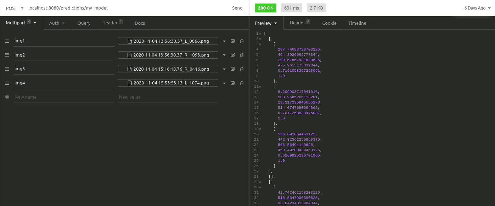

# Yolov5 running on TorchServe (GPU compatible) !

This is a dockerfile to run TorchServe for Yolo v5 object detection model. 
(TorchServe (PyTorch library) is a flexible and easy to use tool for serving deep learning models exported from PyTorch).

You just need to pass a yolov5 weights file (.pt) in the ressources folder and it will deploy a http server, ready to serve predictions.

## Usage

1) Build the torchserve image locally if using a GPU (error with the dockerhub one):
`Build the image torchserve locally for GPU before running this (cf github torchserve)`
 `https://github.com/pytorch/serve/tree/master/docker`
 
 Note: for CPU only, you can take the image from docker-hub directly, it should work fine.
 
2) After trainning a yolo v5 model on COLAB, move the "weights.pt" to the ressources folder and modify the name of your weights.pt file in the Dockerfile (line 20 and line 22)

3)  Modify "index_to_name.json" to match your classes.

4) (Optional) you can modify the `batch size` in the Dockerfile (line 20) and in the `torchserve_handler.py` (line 18) 
 

5) The docker image is ready to be built and used:

`docker build . -t "your_tag:your_version"`

`docker run "your_tag:your_version"`

## Note:

The yolov5 folder in ressources is just here to export the model to a torchscript version.
(It could be optimized to keep only the `export.py` file)

For the docker-compose, you might have an issue with the GPU:
- check that you have nvidia-docker installed
- make a change in docker-compose configs to force GPU usage (there is an issue on docker-compose github open)
